# 🧠 Multimodal RAG with Google Gemini — A Complete Walkthrough

> **What this notebook does in one line:**  
> It builds a pipeline that can **read a PDF containing both text and images**, understand both modalities, and then **answer natural language questions** using the combined knowledge from text _and_ visuals — powered by **CLIP** for understanding and **Google Gemini** for answering.

---

## Table of Contents

1. [The Big Picture — What Are We Building?](#1-the-big-picture--what-are-we-building)
2. [Step 1 — Importing Libraries](#2-step-1--importing-libraries)
3. [Step 2 — Environment Setup & CLIP Model Initialization](#3-step-2--environment-setup--clip-model-initialization)
4. [Step 3 — Image Embedding Function](#4-step-3--image-embedding-function)
5. [Step 4 — Text Embedding Function](#5-step-4--text-embedding-function)
6. [Step 5 — Opening & Processing the PDF](#6-step-5--opening--processing-the-pdf)
7. [Step 6 — Preparing Storage Containers](#7-step-6--preparing-storage-containers)
8. [Step 7 — Text Chunking Strategy](#8-step-7--text-chunking-strategy)
9. [Step 8 — The Main Document Processing Loop](#9-step-8--the-main-document-processing-loop)
10. [Step 9 — Building the FAISS Vector Store](#10-step-9--building-the-faiss-vector-store)
11. [Step 10 — Initializing the Gemini LLM](#11-step-10--initializing-the-gemini-llm)
12. [Step 11 — Multimodal Retrieval Function](#12-step-11--multimodal-retrieval-function)
13. [Step 12 — Creating Multimodal Messages for Gemini](#13-step-12--creating-multimodal-messages-for-gemini)
14. [Step 13 — The Complete RAG Pipeline](#14-step-13--the-complete-rag-pipeline)
15. [How the Full Workflow Flows End-to-End](#15-how-the-full-workflow-flows-end-to-end)
16. [Key Concepts Demystified](#16-key-concepts-demystified)

---

## 1. The Big Picture — What Are We Building?

Imagine you have a PDF report that contains **written text** (like paragraphs about revenue trends) and **charts or images** (like a bar graph showing quarterly revenue). Normally, a language model can only "read" text — it's blind to images. So how do you build a system that:

1. **Understands both text and images** in the PDF?
2. **Finds the most relevant content** (text _or_ image) for a given question?
3. **Sends both text AND images** to a smart AI model to get a comprehensive answer?

That's exactly what this notebook builds — a **Multimodal Retrieval-Augmented Generation (RAG)** pipeline. Here's the high-level flow:

```
┌─────────────┐     ┌───────────────────┐     ┌──────────────────┐     ┌─────────────┐
│  PDF Input   │────▶│  Extract Text &   │────▶│  Embed with CLIP │────▶│ Store in    │
│ (text+images)│     │  Images from PDF  │     │  (unified space) │     │ FAISS Index │
└─────────────┘     └───────────────────┘     └──────────────────┘     └──────┬──────┘
                                                                               │
┌─────────────┐     ┌───────────────────┐     ┌──────────────────┐            │
│  Gemini      │◀────│ Build Multimodal  │◀────│  Retrieve Top-K  │◀───────────┘
│  Answer      │     │ Message (txt+img) │     │  Relevant Docs   │
└─────────────┘     └───────────────────┘     └──────────────────┘
```

---

## 2. Step 1 — Importing Libraries

```python
import fitz  # PyMuPDF
from langchain_core.documents import Document
from transformers import CLIPProcessor, CLIPModel
from PIL import Image
import torch
import numpy as np
from langchain_google_genai import ChatGoogleGenerativeAI
from langchain.prompts import PromptTemplate
from langchain.schema.messages import HumanMessage
from sklearn.metrics.pairwise import cosine_similarity
import os
import base64
import io
from langchain.text_splitter import RecursiveCharacterTextSplitter
from langchain_community.vectorstores import FAISS
from dotenv import load_dotenv
```

### Why each library matters:

| Library                          | Purpose                                                                                                        |
| -------------------------------- | -------------------------------------------------------------------------------------------------------------- |
| `fitz` (PyMuPDF)                 | Opens PDF files and extracts both text and embedded images page by page                                        |
| `Document` (LangChain)           | A standardized wrapper for any piece of content (text, image reference) with metadata                          |
| `CLIPModel` & `CLIPProcessor`    | OpenAI's CLIP model — the key innovation! It can embed **both** text and images into the **same** vector space |
| `PIL.Image`                      | Python Imaging Library — handles image loading, conversion, and manipulation                                   |
| `torch`                          | PyTorch deep learning framework — needed to run CLIP inference                                                 |
| `numpy`                          | Numerical operations on arrays (embedding vectors)                                                             |
| `ChatGoogleGenerativeAI`         | LangChain wrapper around Google's Gemini models for generating answers                                         |
| `HumanMessage`                   | LangChain's way of structuring messages sent to chat models                                                    |
| `cosine_similarity`              | Measures how "similar" two embedding vectors are (used internally)                                             |
| `base64`                         | Encodes images as base64 strings so they can be sent to Gemini's API                                           |
| `io.BytesIO`                     | Lets us treat byte data like a file (in-memory file objects)                                                   |
| `RecursiveCharacterTextSplitter` | Breaks long text into smaller, overlapping chunks for better retrieval                                         |
| `FAISS`                          | Facebook's fast vector similarity search library — for finding relevant documents                              |
| `dotenv`                         | Loads API keys from a `.env` file so we don't hardcode secrets                                                 |

> **Key insight:** The magic of this system comes from CLIP. Unlike traditional text embedding models (like OpenAI's `text-embedding-ada`), CLIP was trained on **text-image pairs**, so it can place both text and images into the **same 512-dimensional vector space**. This means a text query like _"revenue chart"_ will be geometrically close to an image of a bar chart showing revenue — enabling truly multimodal search.

---

## 3. Step 2 — Environment Setup & CLIP Model Initialization

```python
load_dotenv()

# Set up the environment for Google
os.environ["GOOGLE_API_KEY"] = os.getenv("GOOGLE_API_KEY")

### Initialize the CLIP Model for unified embeddings
clip_model = CLIPModel.from_pretrained("openai/clip-vit-base-patch32")
clip_processor = CLIPProcessor.from_pretrained("openai/clip-vit-base-patch32")
clip_model.eval()
```

### What's happening here:

1. **`load_dotenv()`** — Reads your `.env` file and loads environment variables (like `GOOGLE_API_KEY`) into the process. This keeps your API key secure and out of your code.

2. **Setting `GOOGLE_API_KEY`** — Makes the key available as an environment variable so LangChain's Gemini wrapper can authenticate API calls.

3. **Loading CLIP** — We download and load the pre-trained `clip-vit-base-patch32` model from Hugging Face:
   - **`CLIPModel`** — The neural network itself (a Vision Transformer for images + a Text Transformer for text)
   - **`CLIPProcessor`** — Handles pre-processing (tokenizing text, resizing/normalizing images) before they go into the model

4. **`clip_model.eval()`** — Switches the model to **evaluation mode**. This is critical:
   - Disables dropout layers (which randomly zero-out neurons during training)
   - Makes batch normalization use running statistics instead of batch statistics
   - Ensures **deterministic, consistent** outputs for the same input

### Why CLIP and not a regular text embedding model?

Regular embedding models (like Sentence Transformers) can only embed text. If you used one, you'd need a _separate_ model for images, and the two models would produce vectors in _different_ vector spaces — making it impossible to compare text queries against image embeddings directly.

**CLIP solves this** by being trained with a _contrastive learning_ objective: during training, it was shown millions of (image, caption) pairs and learned to place matching pairs close together in a shared 512-dimensional space. So now, a text description and its corresponding image will have similar embeddings.

---

## 4. Step 3 — Image Embedding Function

```python
def embed_image(image_data):
    """Embed image using CLIP"""
    if isinstance(image_data, str):  # If path
        image = Image.open(image_data).convert("RGB")
    else:  # If PIL Image
        image = image_data

    inputs = clip_processor(images=image, return_tensors="pt")
    with torch.no_grad():
        vision_outputs = clip_model.vision_model(pixel_values=inputs['pixel_values'])
        pooled = vision_outputs.pooler_output
        features = clip_model.visual_projection(pooled)
        features = features / features.norm(dim=-1, keepdim=True)
        return features.squeeze().numpy()
```

### Breaking it down step by step:

1. **Flexible input** — Accepts either a file path (string) or a PIL Image object. If it's a string, it opens the file and converts to RGB (3-channel color).

2. **`clip_processor(images=image, return_tensors="pt")`** — Pre-processes the image:
   - Resizes to 224×224 pixels
   - Converts pixel values to tensors
   - Normalizes using CLIP's expected mean and standard deviation

3. **`torch.no_grad()`** — Disables gradient computation since we're only doing inference (not training). This saves memory and speeds things up.

4. **Forward pass through the vision model:**
   - `vision_model(pixel_values=...)` — Passes the image through CLIP's Vision Transformer (ViT). The ViT splits the image into 32×32 pixel patches, treats each patch as a "token", and processes them through 12 transformer layers.
   - `pooler_output` — Takes the output of the `[CLS]` token (a summary of the entire image) — this is a 768-dimensional vector.
   - `visual_projection(pooled)` — Projects the 768-dim vector down to **512 dimensions** to match the shared text-image space.

5. **L2 Normalization** — `features / features.norm(...)` normalizes the vector to unit length. This ensures cosine similarity comparisons work correctly (since cosine similarity on unit vectors = dot product).

6. **Return** — Converts the PyTorch tensor to a NumPy array for compatibility with FAISS and scikit-learn.

> **Why normalize?** Without normalization, vectors with larger magnitudes would dominate similarity searches, regardless of their direction. Normalization ensures we're comparing _direction_ (meaning) rather than _magnitude_ (scale).

---

## 5. Step 4 — Text Embedding Function

```python
def embed_text(text):
    """Embed text using CLIP."""
    inputs = clip_processor(
        text=text,
        return_tensors="pt",
        padding=True,
        truncation=True,
        max_length=77
    )
    with torch.no_grad():
        text_outputs = clip_model.text_model(
            input_ids=inputs['input_ids'],
            attention_mask=inputs['attention_mask']
        )
        pooled = text_outputs.pooler_output
        features = clip_model.text_projection(pooled)
        features = features / features.norm(dim=-1, keepdim=True)
        return features.squeeze().numpy()
```

### Why this mirrors the image function:

This function does for text what `embed_image` does for images — and crucially, it maps the text into the **same 512-dimensional space**. This is what makes cross-modal retrieval possible.

### Step-by-step:

1. **`clip_processor(text=text, ...)`** — Tokenizes the text:
   - `padding=True` — Pads short sequences to a uniform length
   - `truncation=True` — Truncates long text to `max_length=77` tokens (CLIP's limit)
   - Returns `input_ids` (token indices) and `attention_mask` (which tokens are real vs. padding)

2. **Forward pass through the text model:**
   - `text_model(input_ids=..., attention_mask=...)` — Passes tokens through CLIP's 12-layer Text Transformer
   - `pooler_output` — The [EOS] token's representation, summarizing the entire text in 512 dimensions
   - `text_projection(pooled)` — Projects into the shared 512-dim space (same space as images!)

3. **Normalization + return** — Same as the image function for consistent comparisons.

> **Important limitation:** CLIP only handles 77 tokens (~50-60 words). That's why we chunk text in a later step — each chunk must be short enough for CLIP to process.

---

## 6. Step 5 — Opening & Processing the PDF

```python
pdf_path = "multimodal_sample.pdf"
doc = fitz.open(pdf_path)
```

### What this does:

- **`fitz.open(pdf_path)`** — Opens the PDF file using PyMuPDF. The returned `doc` object allows us to:
  - Iterate over pages
  - Extract text from each page
  - Extract embedded images (raster images like PNG/JPEG embedded in the PDF)

> **Why PyMuPDF?** It's one of the most reliable Python libraries for PDF processing. Unlike simple text extractors (like `pdfplumber`), PyMuPDF can also extract embedded images with their raw bytes, which is essential for our multimodal pipeline.

---

## 7. Step 6 — Preparing Storage Containers

```python
# Storage for all documents and embeddings
all_docs = []
all_embeddings = []
image_data_store = {}  # Store actual image data for LLM
```

### Three data structures, three purposes:

| Variable           | Type             | Purpose                                                                                                                                                |
| ------------------ | ---------------- | ------------------------------------------------------------------------------------------------------------------------------------------------------ |
| `all_docs`         | `list[Document]` | Stores LangChain Document objects for every piece of content (text chunk or image reference) with metadata like page number and content type           |
| `all_embeddings`   | `list[np.array]` | Stores the corresponding CLIP embedding vectors (512-dim) for each document — these will be used to build the FAISS index                              |
| `image_data_store` | `dict`           | Maps image IDs (like `"page_0_img_0"`) to their **base64-encoded** PNG data — this is what we send to Gemini later so it can actually "see" the images |

> **Why separate `image_data_store`?** The FAISS index only needs the embedding vector to find similar content. But when we want Gemini to _look at_ the image, we need the actual pixel data. We store it separately as base64 because Gemini's API accepts images as base64-encoded strings.

---

## 8. Step 7 — Text Chunking Strategy

```python
splitter = RecursiveCharacterTextSplitter(chunk_size=500, chunk_overlap=100)
```

### Why chunk text?

There are two important reasons:

1. **CLIP's 77-token limit** — CLIP can only process ~77 tokens at once. Long paragraphs would get truncated, losing information. By chunking into ~500 characters, we ensure each piece fits within CLIP's context window.

2. **Better retrieval precision** — If you embed an entire page as one vector, a query about a specific detail gets compared against the "average" meaning of the whole page. Smaller chunks mean more precise matching.

### What `RecursiveCharacterTextSplitter` does:

- **`chunk_size=500`** — Each chunk is at most 500 characters
- **`chunk_overlap=100`** — Adjacent chunks share 100 characters of overlap

### Why 100 characters of overlap?

Overlap prevents "boundary blindness" — if an important sentence spans two chunks, the overlap ensures it appears fully in at least one of them. Without overlap, you might split a sentence like _"Revenue grew due to | marketing campaigns"_ across two chunks, losing its meaning in both.

```
Chunk 1: "...Q1 showed a moderate increase in revenue as new product lines were introduced. Q2 outperformed Q1 due to marketing campaigns..."
                                                                           ↕ 100 char overlap ↕
Chunk 2: "...Q2 outperformed Q1 due to marketing campaigns. Q3 had exponential growth due to global expansion..."
```

---

## 9. Step 8 — The Main Document Processing Loop

This is the heart of the data ingestion pipeline. It iterates through every page of the PDF and processes both text and images.

```python
for i, page in enumerate(doc):
    ## Process text
    text = page.get_text()
    if text.strip():
        temp_doc = Document(page_content=text, metadata={"page": i, "type": "text"})
        text_chunks = splitter.split_documents([temp_doc])

        for chunk in text_chunks:
            embedding = embed_text(chunk.page_content)
            all_embeddings.append(embedding)
            all_docs.append(chunk)

    ## Process images
    for img_index, img in enumerate(page.get_images(full=True)):
        try:
            xref = img[0]
            base_image = doc.extract_image(xref)
            image_bytes = base_image["image"]

            pil_image = Image.open(io.BytesIO(image_bytes)).convert("RGB")

            image_id = f"page_{i}_img_{img_index}"

            buffered = io.BytesIO()
            pil_image.save(buffered, format="PNG")
            img_base64 = base64.b64encode(buffered.getvalue()).decode()
            image_data_store[image_id] = img_base64

            embedding = embed_image(pil_image)
            all_embeddings.append(embedding)

            image_doc = Document(
                page_content=f"[Image: {image_id}]",
                metadata={"page": i, "type": "image", "image_id": image_id}
            )
            all_docs.append(image_doc)

        except Exception as e:
            print(f"Error processing image {img_index} on page {i}: {e}")
            continue

doc.close()
```

### Text Processing (first half):

1. **Extract text** — `page.get_text()` pulls all text from the current page
2. **Skip empty pages** — `if text.strip()` avoids processing pages with no text
3. **Wrap in a Document** — Creates a LangChain Document with metadata tracking the page number and content type
4. **Split into chunks** — The text splitter breaks it into manageable pieces
5. **Embed each chunk** — Each chunk gets a CLIP text embedding
6. **Store both** — The chunk and its embedding are appended to their respective lists

### Image Processing (second half):

1. **Find all images** — `page.get_images(full=True)` returns a list of image references on the page
2. **Extract image bytes** — Using the `xref` (cross-reference number), we pull the raw image data from the PDF
3. **Convert to PIL** — Transform raw bytes into a PIL Image object in RGB format
4. **Generate unique ID** — `"page_0_img_2"` format ensures each image has a traceable identifier
5. **Store as base64** — Save the image data as a base64 string in `image_data_store` (this will be sent to Gemini later)
6. **Embed the image** — Get a 512-dim CLIP embedding for the image
7. **Create image Document** — A LangChain Document with a placeholder text (`[Image: page_0_img_0]`) and metadata including the image ID

### Why `try/except`?

PDFs can contain all sorts of image formats and edge cases (corrupted images, unsupported formats, tiny 1×1 pixel tracking images). The try/except ensures one bad image doesn't crash the entire pipeline — it just skips it and moves on.

### Resulting data after processing:

For the sample PDF with 1 page of text and 1 chart image:

```
all_docs = [
    Document(text about revenue, page=0, type="text"),
    Document("[Image: page_0_img_0]", page=0, type="image")
]

all_embeddings = [
    array([...512 floats...]),  # text embedding
    array([...512 floats...])   # image embedding
]

image_data_store = {
    "page_0_img_0": "iVBORw0KGgo..."  # base64 PNG data
}
```

---

## 10. Step 9 — Building the FAISS Vector Store

```python
# Create unified FAISS vector store with CLIP embeddings
embeddings_array = np.array(all_embeddings)

vector_store = FAISS.from_embeddings(
    text_embeddings=[(doc.page_content, emb) for doc, emb in zip(all_docs, embeddings_array)],
    embedding=None,  # We're using precomputed embeddings
    metadatas=[doc.metadata for doc in all_docs]
)
```

### What's happening:

1. **Convert to NumPy array** — Stack all embedding vectors into a 2D array of shape `(N, 512)` where N is the total number of documents (text chunks + images).

2. **Build the FAISS index** — `FAISS.from_embeddings()` creates a searchable index:
   - `text_embeddings` — A list of `(content_string, embedding_vector)` tuples
   - `embedding=None` — Tells LangChain we've already computed embeddings (no need for an embedding function)
   - `metadatas` — Attaches metadata to each entry so we can identify results later

### Why FAISS?

FAISS (Facebook AI Similarity Search) is designed for **fast nearest-neighbor search** in high-dimensional spaces. For 2 documents, speed doesn't matter, but this same code could handle thousands of pages. FAISS uses optimized algorithms to search billions of vectors in milliseconds.

### The unified index is the key insight:

Because we used CLIP for **both** text and image embeddings, they all live in the same 512-dim space. This means a single FAISS index can search across **both modalities simultaneously**. A text query about "revenue chart" will match both:

- Text chunks about revenue
- The actual chart image

All in one search operation!

---

## 11. Step 10 — Initializing the Gemini LLM

```python
llm = ChatGoogleGenerativeAI(model="gemini-2.5-flash-lite")
```

### Why Gemini?

Google Gemini is a **natively multimodal** model — it was designed from the ground up to accept and understand **both text and images** as input. This is crucial because:

- When we find a relevant image during retrieval, we need to send it to the LLM
- GPT-style text-only models can't process images
- Gemini can look at a chart image and describe its content, read values from it, or answer questions about it

### Why `gemini-2.5-flash-lite`?

- **Flash** variants are optimized for speed and lower cost
- **Lite** is an even more lightweight version — great for development and testing
- For production, you might upgrade to `gemini-2.5-pro` for better accuracy

---

## 12. Step 11 — Multimodal Retrieval Function

```python
def retrieve_multimodal(query, k=5):
    """Unified retrieval using CLIP embeddings for both text and images."""
    # Embed query using CLIP
    query_embedding = embed_text(query)

    # Search in unified vector store
    results = vector_store.similarity_search_by_vector(
        embedding=query_embedding,
        k=k
    )

    return results
```

### How retrieval works:

1. **Embed the query** — The user's natural language question gets converted into a 512-dim CLIP text embedding using the same `embed_text` function we used during indexing.

2. **Search the vector store** — FAISS finds the `k` nearest neighbors to the query embedding. Since text and images are in the same space, the results may include **both text documents and image documents**.

3. **Return results** — A list of LangChain Document objects, ranked by similarity to the query.

### Why `k=5`?

Retrieving 5 results provides a balance — enough context to answer the question thoroughly, but not so many that irrelevant content dilutes the answer. The parameter is configurable based on your needs.

### The magic moment:

If you ask _"What does the chart show?"_, CLIP's text embedding for that query will be close to:

- The **image embedding** of the actual chart (because CLIP understands text-image correspondence)
- The **text embedding** of paragraphs describing the chart

Both get retrieved, giving Gemini the complete picture!

---

## 13. Step 12 — Creating Multimodal Messages for Gemini

```python
def create_multimodal_message(query, retrieved_docs):
    """Create a message with both text and images for Gemini."""
    content = []

    # Add the query
    content.append({
        "type": "text",
        "text": f"Question: {query}\n\nContext:\n"
    })

    # Separate text and image documents
    text_docs = [doc for doc in retrieved_docs if doc.metadata.get("type") == "text"]
    image_docs = [doc for doc in retrieved_docs if doc.metadata.get("type") == "image"]

    # Add text context
    if text_docs:
        text_context = "\n\n".join([
            f"[Page {doc.metadata['page']}]: {doc.page_content}"
            for doc in text_docs
        ])
        content.append({
            "type": "text",
            "text": f"Text excerpts:\n{text_context}\n"
        })

    # Add images
    for doc in image_docs:
        image_id = doc.metadata.get("image_id")
        if image_id and image_id in image_data_store:
            content.append({
                "type": "text",
                "text": f"\n[Image from page {doc.metadata['page']}]:\n"
            })
            content.append({
                "type": "image_url",
                "image_url": {
                    "url": f"data:image/png;base64,{image_data_store[image_id]}"
                }
            })

    # Add instruction
    content.append({
        "type": "text",
        "text": "\n\nPlease answer the question based on the provided text and images."
    })

    return HumanMessage(content=content)
```

### This function is the bridge between retrieval and generation:

It takes the raw retrieved documents and constructs a **structured multimodal message** that Gemini's API can understand. Think of it as packaging the evidence for the AI.

### The message structure:

```
┌──────────────────────────────────────────────────┐
│  1. Question: "What does the chart show?"        │  ← User's query
├──────────────────────────────────────────────────┤
│  2. Text excerpts:                               │  ← Retrieved text chunks
│     [Page 0]: Annual Revenue Overview...          │     (the written evidence)
├──────────────────────────────────────────────────┤
│  3. [Image from page 0]:                         │  ← Label for the image
│     🖼️ <base64 image data>                       │  ← The actual chart image
├──────────────────────────────────────────────────┤
│  4. "Please answer based on text and images."    │  ← Instruction to the model
└──────────────────────────────────────────────────┘
```

### Key design decisions:

- **Separating text and images** — Groups text excerpts together and images together for clarity
- **Page labels** — `[Page 0]` helps the model reference specific pages in its answer
- **Base64 encoding** — Images are sent as `data:image/png;base64,...` data URIs, which is the standard way to inline images in API requests
- **Final instruction** — Explicitly tells the model to use _both_ modalities, which encourages it to describe chart contents rather than just repeating text

---

## 14. Step 13 — The Complete RAG Pipeline

```python
def multimodal_pdf_rag_pipeline(query):
    """Main pipeline for multimodal RAG with Gemini."""
    # Retrieve relevant documents
    context_docs = retrieve_multimodal(query, k=5)

    # Create multimodal message
    message = create_multimodal_message(query, context_docs)

    # Get response from Gemini
    response = llm.invoke([message])

    # Print retrieved context info
    print(f"\nRetrieved {len(context_docs)} documents:")
    for doc in context_docs:
        doc_type = doc.metadata.get("type", "unknown")
        page = doc.metadata.get("page", "?")
        if doc_type == "text":
            preview = doc.page_content[:100] + "..." if len(doc.page_content) > 100 else doc.page_content
            print(f"  - Text from page {page}: {preview}")
        else:
            print(f"  - Image from page {page}")
    print("\n")

    return response.content
```

### This ties everything together:

1. **Retrieve** → Find the most relevant text chunks and images for the query
2. **Package** → Build a multimodal message with both text and images
3. **Generate** → Send to Gemini and get a natural language answer
4. **Log** → Print what was retrieved for transparency and debugging

### Running with example queries:

```python
queries = [
    "What does the chart on page 1 show about revenue trends?",
    "Summarize the main findings from the document",
    "What visual elements are present in the document?"
]

for query in queries:
    answer = multimodal_pdf_rag_pipeline(query)
    display(Markdown(f"**Answer:**\n\n{answer}"))
```

### Sample output:

> **Query:** "What does the chart on page 1 show about revenue trends?"  
> **Retrieved:** 1 text document + 1 image  
> **Answer:** The chart shows that revenue grew steadily across Q1, Q2, and Q3, with the highest growth in Q3. The blue bar represents Q1, green represents Q2, and red represents Q3.

Notice how Gemini **describes the colors and heights of bars in the chart** — information that exists **only in the image**, not in the text. This proves the multimodal pipeline is working: Gemini is actually _seeing_ and analyzing the chart!

---

## 15. How the Full Workflow Flows End-to-End

Here's the complete journey of a user query through the system:

```mermaid
graph TD
    A["📄 PDF Document"] -->|"fitz.open()"| B["Page Iterator"]
    B -->|"page.get_text()"| C["Raw Text"]
    B -->|"page.get_images()"| D["Raw Images"]

    C -->|"TextSplitter"| E["Text Chunks"]
    E -->|"embed_text()"| F["Text Embeddings (512-dim)"]

    D -->|"PIL + base64"| G["Processed Images"]
    G -->|"embed_image()"| H["Image Embeddings (512-dim)"]
    G -->|"base64 encode"| I["image_data_store"]

    F --> J["🗄️ FAISS Unified Index"]
    H --> J

    K["❓ User Query"] -->|"embed_text()"| L["Query Embedding"]
    L -->|"similarity_search"| J
    J -->|"Top-K Results"| M["Retrieved Docs (text + images)"]

    M -->|"create_multimodal_message()"| N["Multimodal Message"]
    I -->|"base64 images"| N

    N -->|"llm.invoke()"| O["🤖 Google Gemini"]
    O --> P["✅ Final Answer"]
```



### Phase 1: Ingestion (runs once)

1. Open PDF → Extract text and images from each page
2. Chunk text into 500-char pieces with 100-char overlap
3. Embed all chunks and images using CLIP → 512-dim vectors
4. Store everything in a unified FAISS index
5. Store raw image data (base64) separately for later use

### Phase 2: Query (runs per question)

1. User asks a question → Embed it with CLIP
2. Search FAISS for the closest text chunks and images
3. Build a multimodal message (text excerpts + actual image data)
4. Send to Gemini → Get a comprehensive answer

---

## 16. Key Concepts Demystified

### 🔑 What is RAG?

**Retrieval-Augmented Generation** — Instead of relying solely on the LLM's training data, we first _retrieve_ relevant documents from our own data, then _augment_ the prompt with this context before _generating_ an answer. This gives the LLM access to specific, up-to-date information it wasn't trained on.

### 🔑 What makes this "Multimodal"?

Traditional RAG only handles text. **Multimodal RAG** extends this to multiple data types — in our case, **text and images**. The system can retrieve and reason about both written content and visual content like charts, graphs, or photographs.

### 🔑 What is CLIP?

**Contrastive Language-Image Pre-training** (by OpenAI) — A model trained on 400 million image-text pairs from the internet. It learned to map images and their textual descriptions to nearby points in a shared vector space. This shared space is what enables our unified retrieval.

### 🔑 What is FAISS?

**Facebook AI Similarity Search** — A library for efficient similarity search of dense vectors. Given a query vector, it quickly finds the most similar vectors in the index using approximate nearest neighbor algorithms.

### 🔑 Why base64?

Base64 is a way to encode binary data (like image bytes) into ASCII text. This lets us embed image data directly in API requests as text strings, avoiding the need for separate image file uploads.

### 🔑 Why cosine similarity?

Cosine similarity measures the angle between two vectors (ignoring magnitude). Two vectors pointing in the same direction have similarity = 1 (identical meaning), opposite directions = -1 (opposite meaning), and perpendicular = 0 (unrelated). After L2 normalization, cosine similarity equals the dot product.

---

> **🎉 You've made it!** You now understand how to build a system that can intelligently search and reason over documents containing both text and images — combining CLIP's cross-modal understanding with Gemini's multimodal generation capabilities.
