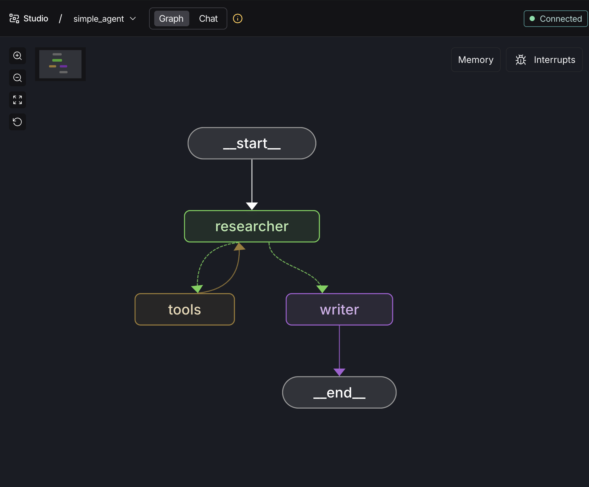
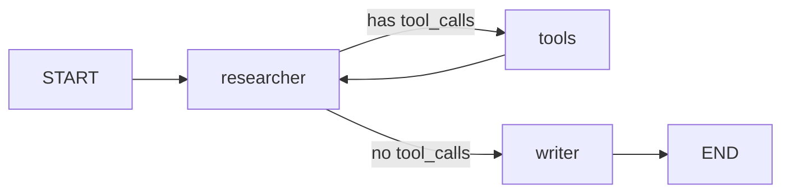
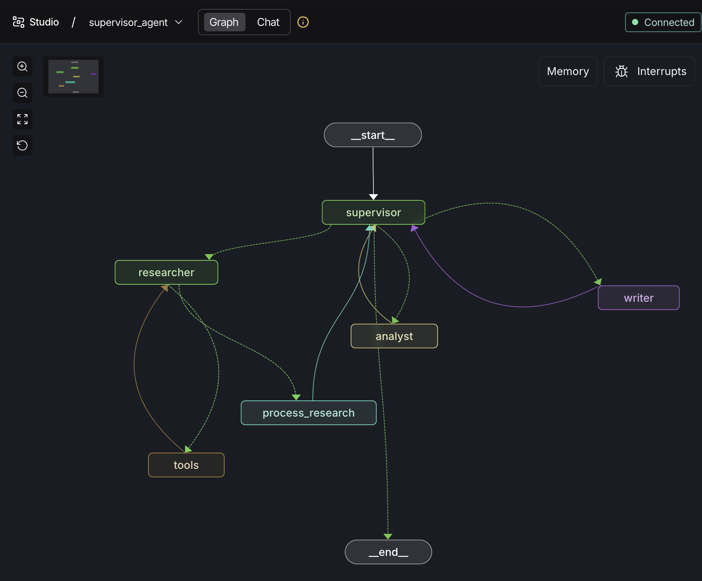
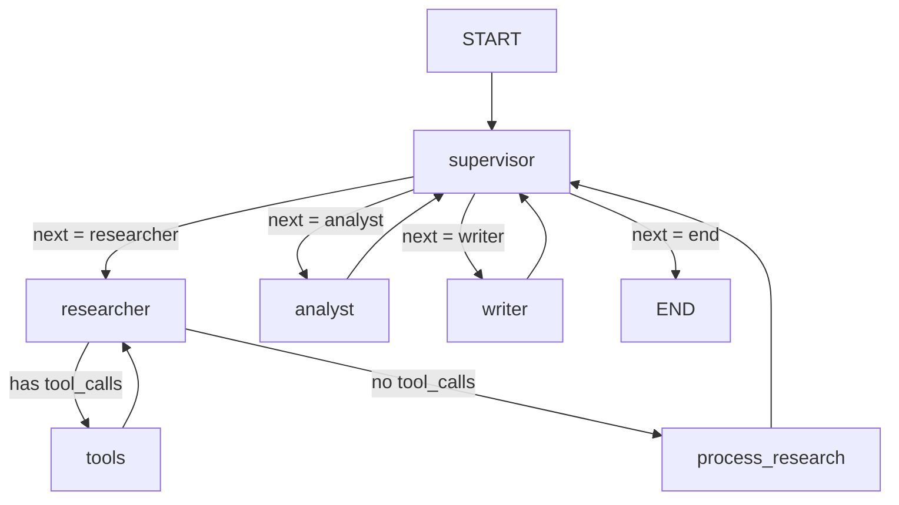

# Multi-Agent Architecture — `multiaiagent.py` Explained

This file implements **two distinct multi-agent architectures** using [LangGraph](https://langchain-ai.github.io/langgraph/):

| Agent              | Architecture       | Agents Involved                            | Use Case                           |
| ------------------ | ------------------ | ------------------------------------------ | ---------------------------------- |
| `simple_agent`     | Linear pipeline    | Researcher → Writer                        | Quick research + summary           |
| `supervisor_agent` | Supervisor pattern | Supervisor → Researcher / Analyst / Writer | Full research report with analysis |

Both agents use **Groq's `llama-3.1-8b-instant`** as the LLM and **Tavily** for web search.

---

## Shared Components

### LLM Setup

```python
llm = init_chat_model("groq:llama-3.1-8b-instant")
```

A single LLM instance is shared across all agents. `init_chat_model` auto-detects the Groq provider from the `groq:` prefix.

### Web Search Tool

```python
@tool
def search_web(query: str) -> str:
    search = TavilySearchResults(max_results=3)
    results = search.invoke(query)
    return str(results)
```

Wrapped with `@tool` so LangGraph's `ToolNode` can automatically execute it when the LLM makes a tool call.

### LangSmith Tracing

All runs are traced to the **"MultiAgent-Project"** in LangSmith for debugging and monitoring.

---

## Graph 1: Simple Agent (`make_simple_agent`)

<!-- Add image -->



### Architecture

A straightforward **linear pipeline** — the researcher gathers data, then the writer summarizes it.

### State

```python
class AgentState(MessagesState):
    next_agent: str  # Tracks which agent goes next
```

Extends `MessagesState` (built-in LangGraph state that manages a list of messages).

### Flow of Execution



**Step-by-step:**

1. **User sends a query** → enters the `researcher` node
2. **Researcher** calls the LLM with `search_web` bound as a tool
3. **Routing decision** (`route_after_researcher`):
   - If the LLM response contains `tool_calls` → route to `tools` node
   - If no tool calls → route to `writer` node
4. **Tools node** (`ToolNode`) executes `search_web` and returns results
5. **Loop**: Tools → Researcher (researcher can make multiple searches)
6. **Writer** receives all messages, extracts user query + research findings, and generates a polished report
7. **END** — the writer's response is the final output

### Key Design Decisions

- **Writer gets a fresh prompt**: Instead of passing raw AI messages (which confuse the LLM), the writer extracts the research content and builds a clean prompt from scratch.
- **Tool loop**: The `tools → researcher` edge allows the researcher to make multiple sequential web searches before moving on.

---

## Graph 2: Supervisor Agent (`make_supervisor_agent`)



### Architecture

A **supervisor pattern** — a central supervisor LLM decides which specialist agent works next, creating a dynamic pipeline.

### State

```python
class SupervisorState(MessagesState):
    next_agent: str       # Which agent should run next
    research_data: str    # Accumulated research findings
    analysis: str         # Analyst's output
    final_report: str     # Writer's final report
    task_complete: bool   # Whether the pipeline is done
    current_task: str     # The user's current query (for new-task detection)
```

> **Why separate state fields?** Instead of relying purely on messages, each stage stores its output in a dedicated field (`research_data`, `analysis`, `final_report`). This lets the supervisor check pipeline progress without parsing messages.

### Flow of Execution



**Step-by-step for a typical run:**

1. **User sends query** → `supervisor` node
2. **Supervisor (Pass 1)**: Sees `has_research=False` → assigns **Researcher**
3. **Researcher**: Calls LLM with `search_web` tool bound
4. **Routing**: If tool calls exist → `tools` → back to `researcher` (loop)
5. **Routing**: When no more tool calls → `process_research`
6. **Process Research**: Extracts tool results + researcher summary → stores in `research_data`
7. **Back to Supervisor (Pass 2)**: Sees `has_research=True`, `has_analysis=False` → assigns **Analyst**
8. **Analyst**: Takes `research_data`, generates insights → stores in `analysis`
9. **Back to Supervisor (Pass 3)**: Sees `has_analysis=True`, `has_report=False` → assigns **Writer**
10. **Writer**: Takes `research_data` + `analysis`, generates executive report → stores in `final_report`
11. **Back to Supervisor (Pass 4)**: Sees `has_report=True` → routes to **END**, delivers the report

---

### Deep Dive: Each Node

#### 🧠 Supervisor Node

The brain of the system. It does three things:

1. **Extracts the latest user query** by scanning messages in reverse for the last `HumanMessage`
2. **Detects new tasks** — if the current query differs from `current_task`, it resets all pipeline state
3. **Calls the LLM** with the current pipeline status (`has_research`, `has_analysis`, `has_report`) and asks it to pick the next agent
4. **Fallback safeguards** — even if the LLM gives a wrong answer, the `elif` chain enforces the correct pipeline order:

```
no research → researcher
has research, no analysis → analyst
has analysis, no report → writer
has report → end
```

> **Important**: The LLM decision is a _hint_. The fallback logic (`or not has_research`) ensures the pipeline never skips a stage.

#### 🔍 Researcher Node

- Filters messages to only pass **user queries + tool messages** to the LLM (strips out supervisor/analyst/writer noise)
- Uses `llm.bind_tools([search_web])` so the LLM can make tool calls
- After research, flows through `route_after_researcher`:
  - Has `tool_calls` → goes to `tools` (ToolNode executes the search)
  - No tool calls → goes to `process_research`

#### 📦 Process Research Node

A **pure data extraction node** (no LLM call). It:

1. Collects all `ToolMessage` content (raw search results)
2. Finds the researcher's final summary (last non-tool AI message)
3. **Filters out noise** using emoji prefixes — skips messages starting with `📋`, `✅`, `✍️`, `📊`
4. Stores everything in `research_data`

#### 📊 Analyst Node

- Takes `research_data` from state (NOT from messages)
- Generates insights: patterns, strategic implications, risks, recommendations
- Stores output in `analysis` state field
- Prefixes its message with `📊` for identification

#### ✍️ Writer Node

- Takes both `research_data` and `analysis` from state
- Uses a structured XML-style prompt for reliable formatting
- Generates a full executive report with:
  - Executive Summary → Key Findings → Detailed Analysis → Recommendations → Conclusion
- Wraps the report in a formatted banner with timestamp
- Stores in `final_report` state field

#### 🔀 Router Function

```python
def router(state) -> Literal["researcher", "analyst", "writer", "__end__"]:
    next_agent = state.get("next_agent", "end")
    if next_agent == "end":
        return END
    if next_agent in ["researcher", "analyst", "writer"]:
        return next_agent
    return END  # Safe fallback
```

Translates the supervisor's `next_agent` decision into a LangGraph routing target. Unknown values safely fall back to `END`.

---

### Supervisor Chain (Prompt + LLM)

The supervisor uses a cached `ChatPromptTemplate | llm` chain:

```python
supervisor_chain = supervisor_prompt | llm
```

**Why cached?** The `get_supervisor_chain()` function uses `nonlocal` to create the chain only once, avoiding re-creating the prompt template on every supervisor call.

**Prompt variables:**

- `{has_research}` — `True/False`
- `{has_analysis}` — `True/False`
- `{has_report}` — `True/False`
- `{task}` — the user's query

---

### Graph Edges Summary

| From               | To                                          | Type        | Condition             |
| ------------------ | ------------------------------------------- | ----------- | --------------------- |
| `START`            | `supervisor`                                | Entry point | Always                |
| `supervisor`       | `researcher` / `analyst` / `writer` / `END` | Conditional | Based on `router()`   |
| `researcher`       | `tools`                                     | Conditional | If `tool_calls` exist |
| `researcher`       | `process_research`                          | Conditional | If no tool calls      |
| `tools`            | `researcher`                                | Fixed       | Always (tool loop)    |
| `process_research` | `supervisor`                                | Fixed       | Always                |
| `analyst`          | `supervisor`                                | Fixed       | Always                |
| `writer`           | `supervisor`                                | Fixed       | Always                |

---

### New Task Detection (Multi-Turn Support)

```python
previous_task = state.get("current_task", "")
is_new_task = previous_task and previous_task != latest_task

if is_new_task:
    result["research_data"] = ""
    result["analysis"] = ""
    result["final_report"] = ""
```

If a user sends a **second query** in the same session, the supervisor detects that `current_task` changed, resets all accumulated data, and starts the pipeline fresh. This prevents stale research/analysis from leaking into a new report.

---

### Message Filtering Strategy

A critical design pattern in this codebase — **emoji prefixes** act as message tags:

| Prefix | Source                 | Purpose                  |
| ------ | ---------------------- | ------------------------ |
| `📋`   | Supervisor (assigning) | "Assigning task to X..." |
| `✅`   | Supervisor (done)      | "All tasks complete!"    |
| `📊`   | Analyst                | Analysis output          |
| `✍️`   | Writer                 | Confirmation message     |

`process_research_results` uses these prefixes to **skip non-research messages** when collecting research data. Without this, supervisor instructions or analyst conclusions would accidentally get mixed into the research.

---

## How to Run

Both graphs are exported as compiled LangGraph objects at module level:

```python
simple_agent = make_simple_agent()
supervisor_agent = make_supervisor_agent()
```

Registered in `langgraph.json`:

```json
{
  "graphs": {
    "simple_agent": "./multiaiagent.py:simple_agent",
    "supervisor_agent": "./multiaiagent.py:supervisor_agent"
  }
}
```

**Start the dev server:**

```bash
cd Agents
langgraph dev
```

This opens LangGraph Studio where you can interact with both agents visually.
